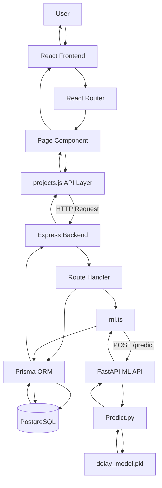

# PRAVEG — Project Delay Risk Prediction System

A full-stack application for managing infrastructure projects and predicting project delay risk using machine learning.

Built using **React**, **Node.js**, **Express.js**, **TypeScript**, **PostgreSQL**, **Prisma**, **FastAPI**, and **Python**.

---

# Features

## Project Management

- Create projects
- View all projects
- View project details
- Update projects
- Delete projects
- Search projects
- Filter by state
- Filter by district
- Filter by risk level

---

## AI Delay Risk Prediction

- Predict project delay risk
- Low / Medium / High classification
- Risk score
- Prediction confidence
- Probability distribution
- Risk factors
- Recommendations
- Model version tracking
- Saved prediction records

---

# Project Risk Flow

```text
Project Data
     │
     ▼
Feature Preparation
     │
     ▼
ML Prediction
     │
     ├──── Low
     ├──── Medium
     └──── High
     │
     ▼
Risk Score + Probabilities
     │
     ▼
Risk Explanation
     │
     ▼
Saved RiskPrediction
```

---

# Request Flow



---

# Create Project Flow

```text
User
 │
 ▼
ProjectForm.jsx
 │
 ▼
createProject()
 │
 ▼
POST /api/projects
 │
 ▼
Express Backend
 │
 ├── Validate project
 │
 ├── Save Project
 │       │
 │       ▼
 │   PostgreSQL
 │
 └── Create Prediction
         │
         ▼
       ml.ts
         │
         ▼
      FastAPI
         │
         ▼
     Predict.py
         │
         ▼
    delay_model.pkl
         │
         ▼
      Prediction
         │
         ▼
    RiskPrediction
         │
         ▼
     PostgreSQL
         │
         ▼
      Response
         │
         ▼
       React
```

---

# Update Project Flow

```text
User
 │
 ▼
ProjectForm.jsx
 │
 ▼
updateProject()
 │
 ▼
PUT /api/projects/:id
 │
 ▼
Express Backend
 │
 ├── Validate project
 │
 ├── Update Project
 │       │
 │       ▼
 │   PostgreSQL
 │
 └── Create new Prediction
         │
         ▼
       ml.ts
         │
         ▼
      FastAPI
         │
         ▼
     Predict.py
         │
         ▼
    delay_model.pkl
         │
         ▼
      Prediction
         │
         ▼
    RiskPrediction
         │
         ▼
      Response
         │
         ▼
       React
```

---

# Get Project Flow

```text
User
 │
 ▼
ProjectList / ProjectDetail
 │
 ▼
getProjects() / getProject()
 │
 ▼
GET /api/projects
GET /api/projects/:id
 │
 ▼
Express Backend
 │
 ▼
Prisma ORM
 │
 ▼
PostgreSQL
 │
 ▼
Project Data
 │
 ▼
Express Response
 │
 ▼
React Frontend
```

---

# Delete Project Flow

```text
User
 │
 ▼
ProjectDetails
 │
 ▼
deleteProject(id)
 │
 ▼
DELETE /api/projects/:id
 │
 ▼
Express Backend
 │
 ▼
Prisma ORM
 │
 ▼
PostgreSQL
 │
 ▼
Project Deleted
 │
 ▼
React → /projects
```

---

# User Interface

The application contains the following main pages:

```text
Dashboard
Projects
New Project
Project Details
Edit Project
```

---

# 🛠 Tech Stack

- React
- React Router
- Node.js
- Express.js
- TypeScript
- PostgreSQL
- Prisma ORM
- Python
- FastAPI
- Pandas
- scikit-learn
- Joblib
- Docker
- pnpm

---

# Project Structure

```text
PRAVEG
│
├── backend
│   ├── prisma
│   │   ├── schema.prisma
│   │   └── migrations
│   │
│   ├── scripts
│   │
│   └── src
│       ├── app.ts
│       ├── server.ts
│       ├── ml.ts
│       └── reference-data.ts
│
├── frontend
│   └── src
│       ├── api
│       │   └── projects.js
│       │
│       ├── components
│       │
│       ├── pages
│       │   ├── Dashboard.jsx
│       │   ├── ProjectList.jsx
│       │   ├── ProjectDetail.jsx
│       │   └── ProjectForm.jsx
│       │
│       ├── App.jsx
│       └── main.jsx
│
├── ml-api
│   ├── api.py
│   ├── Predict.py
│   └── delay_model.pkl
│
├── Datastructure.xlsx
└── docker-compose.yml
```

---

# Database Models

## Project

Stores project information including:

- Project name
- Project type
- State
- Districts
- Land area
- Affected families
- Budget
- Compensation
- Legal disputes
- Possession
- Stakeholder responsiveness
- Historical performance

## RiskPrediction

Stores:

- Delay risk
- Risk score
- Confidence
- Low probability
- Medium probability
- High probability
- Reason
- Risk factors
- Recommendations
- Model version
- Creation timestamp

### Relationship

```text
Project 1 ─────────── * RiskPrediction
```

Each project can have multiple saved predictions.

---

# API Endpoints

## Backend Health

| Method | Endpoint |
| ------ | -------- |
| GET | `/health` |

---

## Reference Data

| Method | Endpoint |
| ------ | -------- |
| GET | `/api/reference-data` |

---

## Projects

| Method | Endpoint |
| ------ | -------- |
| GET | `/api/projects` |
| GET | `/api/projects/:id` |
| POST | `/api/projects` |
| PUT | `/api/projects/:id` |
| DELETE | `/api/projects/:id` |
| POST | `/api/projects/:id/predict` |

---

# ML API

| Method | Endpoint |
| ------ | -------- |
| GET | `/health` |
| POST | `/predict` |

---

# Machine Learning Pipeline

```text
Project Data
     │
     ▼
Feature Preparation
     │
     ▼
Pandas DataFrame
     │
     ▼
Pre-trained ML Pipeline
     │
     ├── Missing Value Imputation
     ├── Numeric Feature Processing
     ├── Categorical Feature Processing
     └── Classification
     │
     ▼
Prediction Probabilities
     │
     ▼
Low / Medium / High
```

The trained model is loaded once when the ML API starts:

```text
delay_model.pkl
```

The prediction service returns:

```json
{
  "predicted_class": "Medium",
  "confidence": 0.829,
  "probabilities": {
    "Low": 0.025,
    "Medium": 0.829,
    "High": 0.147
  }
}
```

---

# Risk Score

The risk score is calculated from the model probabilities:

```text
Risk Score =
(High Probability × 100)
+
(Medium Probability × 50)
```

Low probability contributes zero to the score.

The final score ranges from **0–100**.

---

# Data Source

Project data is sourced from:

```text
Datastructure.xlsx
```

The data is imported into PostgreSQL and accessed through Prisma ORM.

Missing values from the source dataset are preserved where applicable.

---

# Running Locally

## 1. Start PostgreSQL

```bash
docker compose up -d postgres
```

---

## 2. Start Backend

```bash
cd backend
pnpm install
pnpm dev
```

Backend:

```text
http://localhost:5000
```

---

## 3. Start ML API

```bash
cd ml-api
python -m uvicorn api:app --host 127.0.0.1 --port 8000
```

ML API:

```text
http://localhost:8000
```

---

## 4. Start Frontend

```bash
cd frontend
pnpm install
pnpm dev
```

Frontend:

```text
http://localhost:5173
```

---

# API Documentation

FastAPI provides interactive API documentation through Swagger UI.

```text
http://localhost:8000/docs
```

---

# HTTP Status Codes

| Code | Meaning |
| ---- | ------- |
| 200 | OK |
| 201 | Created |
| 204 | No Content |
| 400 | Bad Request |
| 404 | Not Found |
| 503 | ML API Unavailable |
| 500 | Internal Server Error |

---

# Architecture

```text
                    ┌─────────────────┐
                    │      User       │
                    └────────┬────────┘
                             │
                             ▼
                    ┌─────────────────┐
                    │ React Frontend  │
                    └────────┬────────┘
                             │
                             │ REST API
                             ▼
                    ┌─────────────────┐
                    │ Express Backend │
                    └───────┬─┬───────┘
                            │ │
                    Prisma  │ │ ML Request
                            │ │
                            ▼ ▼
                   ┌───────────┐  ┌─────────────┐
                   │PostgreSQL │  │   FastAPI   │
                   └───────────┘  └──────┬──────┘
                                         │
                                         ▼
                                  ┌─────────────┐
                                  │ Predict.py  │
                                  └──────┬──────┘
                                         │
                                         ▼
                                  ┌─────────────┐
                                  │ ML Pipeline │
                                  └──────┬──────┘
                                         │
                                         ▼
                                  ┌─────────────┐
                                  │ Risk Result │
                                  └─────────────┘
```

---

# Security & Validation

The backend implements:

- CORS configuration
- JSON request size limit
- Input validation
- Approved project type validation
- Approved state validation
- Approved district validation
- Numeric range validation
- Integer validation
- Error handling
- Prisma database constraints

---

# Deployment

The application is designed as a multi-service architecture:

```text
React Frontend
      │
      ▼
Express Backend
      │
      ├──────────────► PostgreSQL
      │
      └──────────────► FastAPI ML API
```

---

# Contributors

- **Aryan Mishra** : https://github.com/ARYAN0-work
- **Tanush Rathore** : https://github.com/tanush-code
- **Aayushi Agarwal** : https://github.com/aayushiag27
- **Angel Verma** : https://github.com/AngelVerma79
- **Vigya Verma** : https://github.com/Coder240807
- **Adityan pushkar** : https://github.com/Adityan16-adi